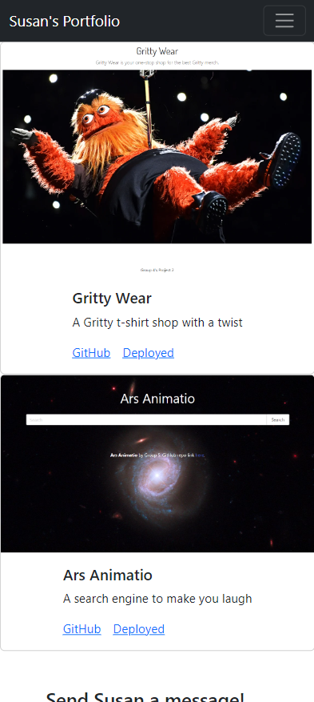

# Susan's Portfolio via React

## Description 
Susan's Portfolio using React.

## Table of Contents

- [Installation](#installation)
- [Tech Used](#tech-used)
- [Preview](#preview)
- [Licensing](#licensing)
- [Contact Info](#contact-info)

## Installation

After cloning the repo, in the CLI type `npm start` and my portfolio will open up in localhost.

## Tech Used
* [Node.js](https://nodejs.org/en/)
* [Express.js](https://expressjs.com/)
* [React.js](https://reactjs.org/)
* [Create React App](https://github.com/facebook/create-react-app)

## Preview
Featuring mobile-friendly design! Condensed menu and website previews are full-width to a device's screen (in this case, an iPhone 12).

## Licensing
MIT License

## Contact Info
If you have any questions about the repo, contact Susan.